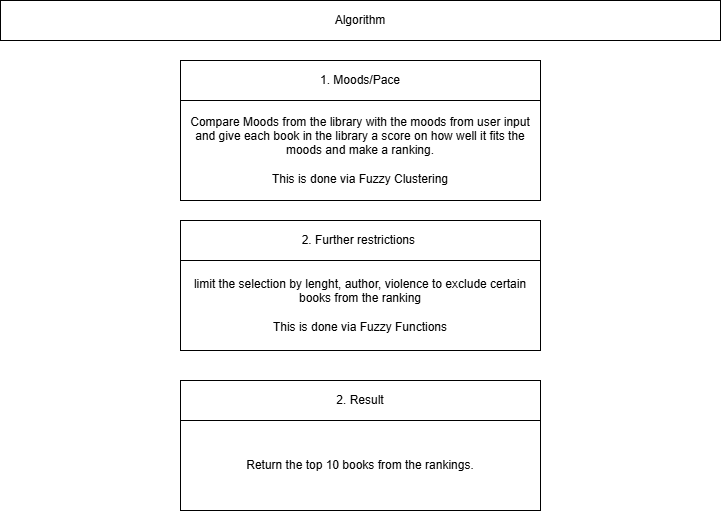

# Bookwyrm
Bookwyrm is a project developed in the context of the Fuzzy Sets class. The goal is to make a small app or plugin to help people find new fantasy book suggestions.

## Problem Identification and Motivation

The initial idea was to make an app to suggest fantasy books to a reader. We thought of using the book libraries of the user and/or a questionnaire as input to our app to generate suggestions. Interviews we made provided us with category ideas to focus on for helping in the selection.

This led to the creation of a simple prototype which was shown in the presentation and afterwards to some friends. The feedback from these events made us recognise that our initial idea was lacking a special selling point. The idea we came up with is to focus primarily on the moods the books convey. So instead of categorizing a book via rating and reviews we mainly categorize the moods of the book. This was made possible by finding an interesting site [StoryGraph](https://app.thestorygraph.com/) where readers rate the books by their moods.

## Define the objectives for a solution.

With this new idea we created a new prototype. The prototype is going to make use of fuzzy clustering to compare the moods ratings of the books with either a questionnaire or the users library. 

For the questionnaire we have two ideas at this moment, which will have to be evaluated.
-The users will be asked for each mood/pace how they feel about it and with that result we are going to calculate a vector to compare with our library.
-The users will get a more fuzzy questionnaire where each question can give rating to more then one mood. The results of the questionnaire will then be aggregated to calculate a vector to compare with our library

## Design and development.

### Data

The dataset used in this project comes from the [StoryGraph](https://app.thestorygraph.com/). This website provides detailed information and analytics about books. It aggregates user-generated impressions and reading experiences. In particular, it provides statistics on how readers felt about each book, including:
- **Moods** (reflective, emotional, adventurous,...)
- **Pace** (slow, medium, fast)
- **Additional attributes** such as genre tags, content warnings, length and community ratings.
  
These features make StoryGraph the perfect resource for building recommendation or classification systems.

The data is stored in a CSV file with currently the following categories:

**Main:**
- Title
- Author
- Length

**Moods:**
- Adventurous
- Challenging
- Dark
- Emotional
- Funny
- Hopeful
- Informative
- Inspiring
- Lighthearted
- Mysterious
- Reflective
- Relaxing
- Sad
- Tense

**Pace:**
- Slow
- Medium
- Fast

### Algorithm basic setup

## Demonstration

Will be done after the artefact is created. We are going to hand the the artefact to some people who read a lot of fantasy books, to give us feedback on how good our suggestions are and how they felt about using it.

# Litterature
- Brocke, Jan vom & Hevner, Alan & Maedche, Alexander. (2020). Introduction to Design Science Research. 10.1007/978-3-030-46781-4_1.
- The StoryGraph website [https://app.thestorygraph.com/](https://app.thestorygraph.com/), © 2025 The StoryGraph Ltd.
